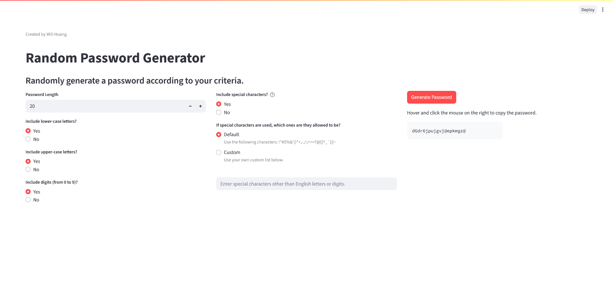

# Introduction

This is a simple web-based application that randomly generates passwords. You can specify criteria 
such as password length and which symbols should appear. 

If you have multiple online accounts that require passwords to log in, or if you need to refresh your password 
periodically, this app will suggest to you a new password quickly and easily while complying with password 
requirements. The randomness will also make your password stronger and harder to guess.     

# How to Use This App

The app is deployed here:

[https://random-password-generator.streamlit.app/](https://random-password-generator.streamlit.app/)

In a typical password, there are 4 groups of symbols:

- Upper-case English letters
- Lower-case English letters
- Digits (from 0 to 9)
- Special characters (i.e., characters not in the other groups above)

In the app's interface, you can specify "Yes" or "No" for whether the generated password will contain symbols from these groups.

In case the required password contains / should not contain certain special characters in the default setting, 
you can also provide your own custom set of special symbols.

Once the password criteria are set, click the "Generate" button and copy the generated password.

**Additional Improvements in the Future**

This app strives to be simple, but some nice-to-have improvements are sought after.
- Have a "Copy to Clipboard" button that copies the created password to the user's clipboard.
- Keep the previously generated password even when changing the password custimization options. Currently, the interface would erase the previous password whenever you select a different customization option.

**App History**

Created by Will Huang

Version 1.0.0
- Initial version

Version 2.0.0
- Updated the streamlit version used from 1.26.0 to 1.46.0.
- Removed the option to randomly decide whether to include a group of symbols. Now the radio button options are either "Yes" or "No".
- Changed the default password length to 20.
- Added a button to copy the generated password. Also added texts in the interface to mention this feature.
- Made the generated password persist even after changing the options. Previously, the password would disappear after changing the options.

Version 2.1.0
- Changed the default setting to include special characters.

**License**

This code was developed by using the [Streamlit software licensed under Apache 2.0](
https://streamlit.io/deployment-terms-of-use#:~:text=The%20Streamlit%20software%20%28the%20Python%20library%29%20is%20open-sourced,and%20deployment%20service%29%20is%20proprietary%20to%20Snowflake%20Inc.).
